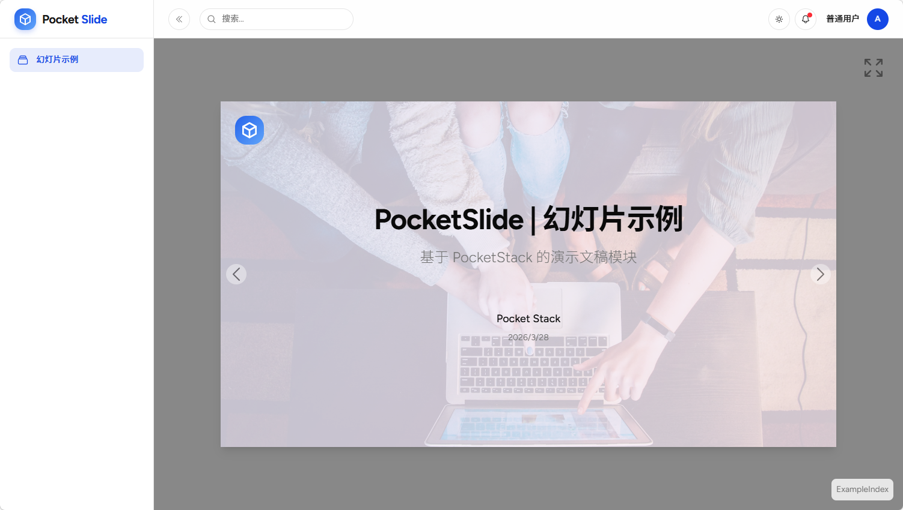
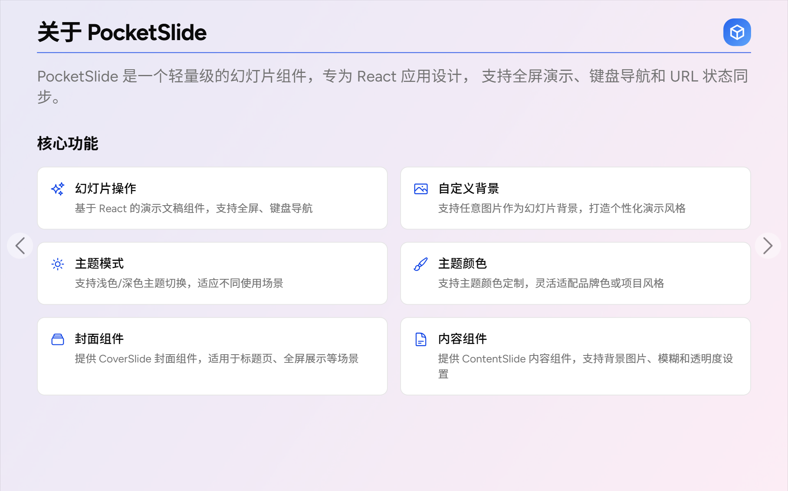
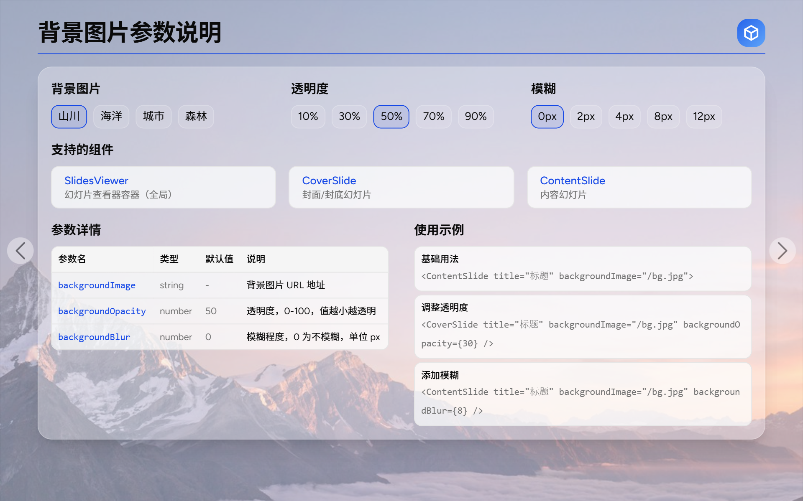
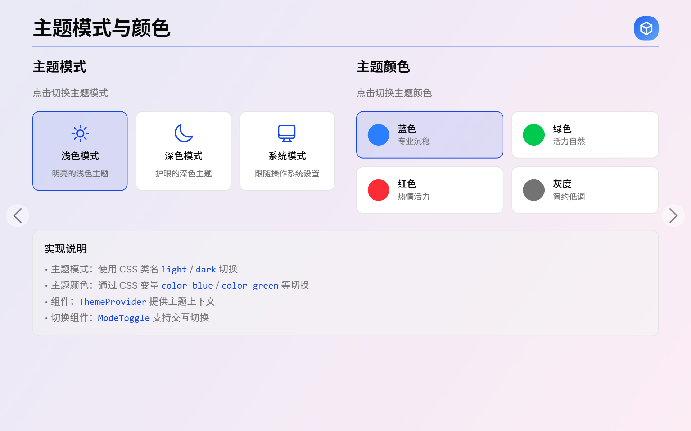
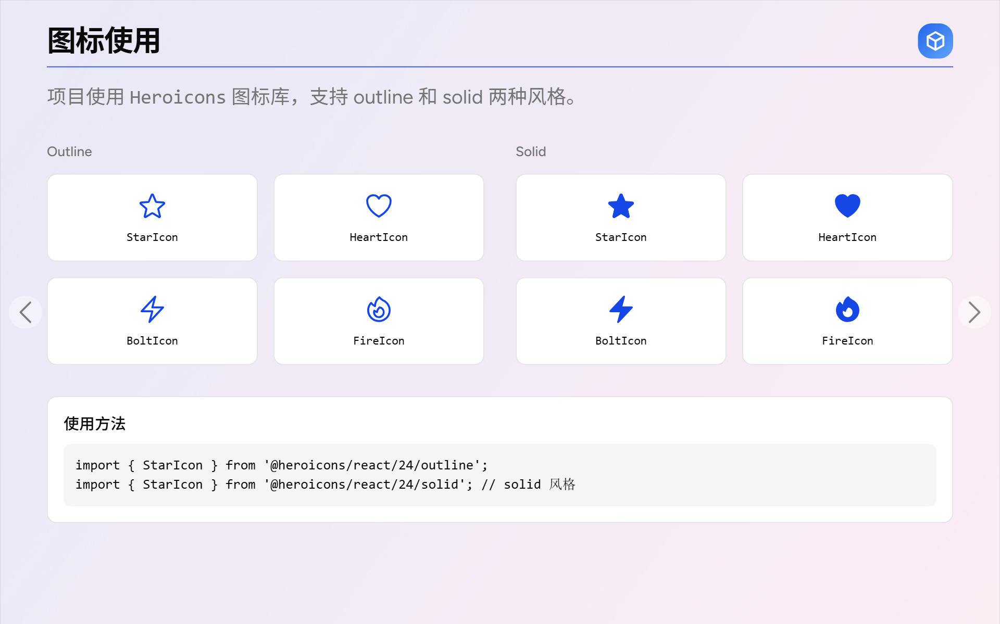
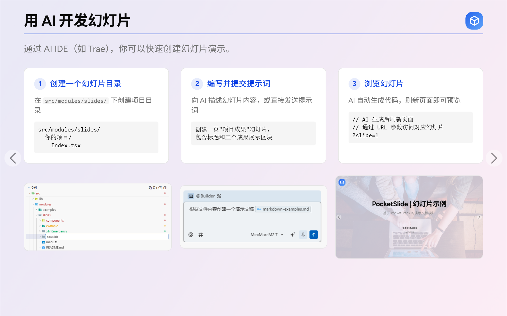

# Pocket Slide ：幻灯片/演示文稿开发模块

基于 PocketStack 的幻灯片/演示文稿开发模块。不同于 slidev、reveal.js 等工具，该项目以AI友好为原则，非常适合以 Vibe Coding 的方式开发演示文稿项目。

## 特性

- **幻灯片操作** - 基于 React 的演示文稿组件，支持全屏、键盘导航
- **定义屏幕比例** - 适配不同屏幕尺寸，支持全屏展示
- **自定义背景** - 支持任意图片作为幻灯片背景，打造个性化演示风格
- **主题模式** - 支持浅色/深色/系统主题切换，适应不同使用场景
- **主题颜色** - 支持主题颜色定制（蓝色/绿色/红色/灰度），灵活适配品牌色
- **模糊效果** - 支持背景模糊和透明度设置，增强视觉层次感
- **AI IDE 开发** - 支持通过 AI IDE 快速创建幻灯片

## 使用说明

### 键盘操作

- `→` 或 `↓`：下一页
- `←` 或 `↑`：上一页
- `Esc`：退出全屏

### 点击操作

- 左右箭头按钮：翻页
- 全屏按钮：进入/退出全屏

## Demo 截图













## AI IDE 开发

通过 AI IDE（如 Trae），你可以快速创建幻灯片演示：

1. 在 `src/modules/slides/` 下创建项目目录
2. 编写提示词，向 AI 描述幻灯片内容
3. AI 自动生成代码，刷新页面即可预览

## 文件目录结构

该组件可以创建多个演示文稿，每个演示文稿可以包含多个幻灯片。

每个演示文稿的目录放在`src/modules/slides/`目录下，每个目录对应一个演示文稿。

- `src/modules/slides/components/` - 组件目录
  - `CoverSlide.tsx` - 封面幻灯片组件
  - `ContentSlide.tsx` - 内容幻灯片组件
  - `SlidesViewer.tsx` - 幻灯片查看器组件
  - `Logo.tsx` - Logo 组件
- `src/modules/slides/slidename/` - 演示文稿目录
  - `index.tsx` - 演示文稿首页
  - `Slide1.tsx` - 第一页幻灯片
  - `Slide2.tsx` - 第二页幻灯片
- `menu.ts` - 导航菜单组件
- `routes.tsx` - 路由配置

## 组件

### SlidesViewer

幻灯片查看器组件，用于包裹所有幻灯片页面。

```tsx
import SlidesViewer from '@/modules/slides/components/SlidesViewer';

<SlidesViewer>
  <Slide1 />
  <Slide2 />
  <Slide3 />
</SlidesViewer>
```

#### Props

| 属性 | 类型 | 默认值 | 说明 |
|------|------|--------|------|
| children | `React.ReactNode[]` | - | 幻灯片内容数组 |
| className | `string` | - | 自定义样式类 |
| showNavigation | `boolean` | `true` | 是否显示导航按钮 |
| onSlideChange | `(index: number) => void` | - | 翻页回调函数 |
| backgroundImage | `string` | - | 全局背景图片 URL |
| backgroundOpacity | `number` | `50` | 背景透明度，0-100 |
| backgroundBlur | `number` | `0` | 背景模糊程度，单位 px |
| logoSrc | `string` | `/logo.svg` | Logo 图片路径 |

### CoverSlide

封面幻灯片组件，用于展示封面。

```tsx
import CoverSlide from '@/modules/slides/components/CoverSlide';

<CoverSlide
  title="幻灯片标题"
  subtitle="副标题"
  author="作者"
  date="2024-01-01"
/>
```

#### Props

| 属性 | 类型 | 说明 |
|------|------|------|
| title | `string` | 主标题 |
| subtitle | `string` | 副标题 |
| author | `string` | 作者 |
| date | `string` | 日期 |
| className | `string` | 自定义样式类 |
| backgroundImage | `string` | 背景图片 URL |
| backgroundOpacity | `number` | 背景透明度，0-100，默认 50 |
| backgroundBlur | `number` | 背景模糊程度，单位 px，默认 0 |

### ContentSlide

内容幻灯片组件，用于展示正文内容。

```tsx
import ContentSlide from '@/modules/slides/components/ContentSlide';

<ContentSlide title="页面标题">
  <div>内容区域</div>
</ContentSlide>
```

#### Props

| 属性 | 类型 | 说明 |
|------|------|------|
| title | `string` | 页面标题 |
| children | `React.ReactNode` | 内容区域 |
| className | `string` | 自定义样式类 |
| backgroundImage | `string` | 背景图片 URL |
| backgroundOpacity | `number` | 背景透明度，0-100，默认 50 |
| backgroundBlur | `number` | 背景模糊程度，单位 px，默认 0 |

## PocketStack

本项目基于 PocketStack 开发。 PocketStack 是一款 AI 友好的全栈开发框架，助力实现98%的 Vibe Coding。

http://github.com/citywill/pocket-stack

## 微信交流

